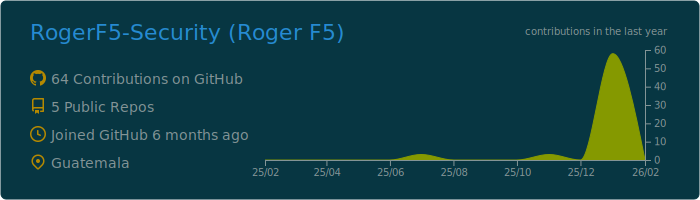
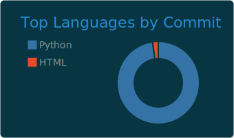
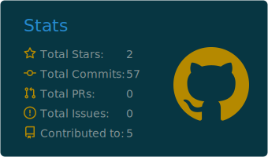
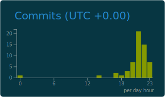

  

 

### 👨‍💻 Perfil Profesional

Soy **Ingeniero de Sistemas** y **Auditor de Seguridad Ofensiva (Pentester)**. 
Especializado en el ciclo de vida completo de pruebas de intrusión, desde el reconocimiento hasta la explotación y post-explotación controlada.

* 🔐 **Core:** Seguridad Ofensiva, Desarrollo Seguro, Auditoría Técnica.
* 🐍 **Desarrollo:** Creación de herramientas de Ciberseguridad en Python (Automatización + GUI).
* 🛠️ **Hardware Hacking:** Investigación y desarrollo sobre Flipper Zero, ESP32 y RF.
* 📜 **Credenciales:** CPTE | CPEH | CCEP.

---

### 📈 Métricas y Actividad

  

  
  

  
  

---

### 🛠️ Arsenal Técnico

**Reconocimiento & Escaneo de Vulnerabilidades**

  
  
  
  
  

**Desarrollo Ofensivo & Scripting**

  
  
  
  

**Hardware Hacking & RF**

  
  

---

  
  

