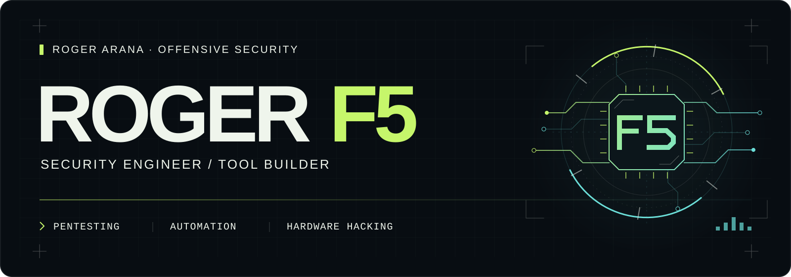
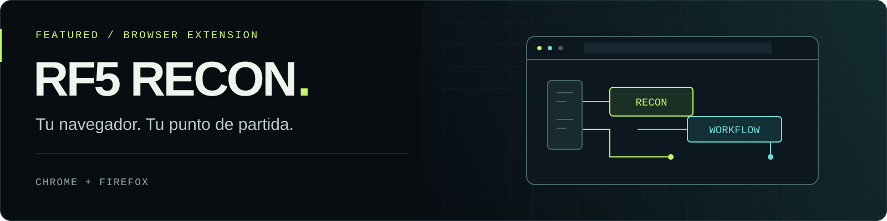
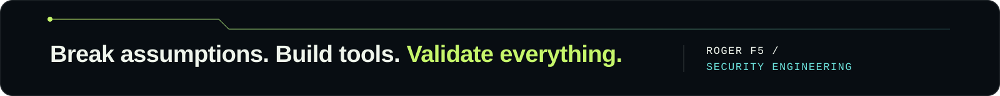

 

**Del reconocimiento a la evidencia. Del código al hardware.**

Ingeniero en Sistemas · Seguridad Ofensiva · Desarrollo Seguro

 

[Sobre mí](#01--whoami) · [RF5 RECON](#02--rf5-recon) · [Proyectos](#03--built-in-the-lab) · [Arsenal](#04--arsenal) · [Comunidad](#05--beyond-the-terminal)

 

## 01 / WHOAMI

Soy **Roger Arana**, también conocido como **Roger F5**. Ingeniero en Sistemas de Guatemala, especializado en seguridad ofensiva y desarrollo seguro. Conecto el pentesting con la ingeniería: automatización en Python, revisión de código, extensiones de navegador y laboratorios de hardware.

> Recon faster. Validate deeper. Report cleaner. Harden smarter.

| SECURITY RESEARCH | TOOL ENGINEERING | HARDWARE LAB |
| :--- | :--- | :--- |
| Pentesting web, móvil, APIs e infraestructura. Validación de vulnerabilidades y documentación técnica. | Python, fuzzing, código seguro y SDLC. Herramientas CLI, GUI y reportes HTML, XLSX y JSON. | RF, BLE, Wi-Fi, NFC/RFID y HID. Experimentación con dispositivos y sistemas embebidos. |

**Certificaciones:** `C)PTE` · `C)PEH` · `CCEP` · `CAIS` · `Cisco Ethical Hacker`

[Ver credenciales en Credly](https://www.credly.com/users/roger-arana) · [Trayectoria y certificaciones](https://rogerf5-security.github.io/whoami/)

 

## 02 / RF5 RECON

Mi extensión para agilizar el **reconocimiento y el flujo de evaluación de seguridad desde el navegador**. Un acceso directo a las herramientas del día a día del pentester.

  
  

 

## 03 / BUILT IN THE LAB

Herramientas y proyectos propios: del software de auditoría a la seguridad portátil.

<table>
<tr>
<td width="50%" valign="top">

### [Scan Titan ↗](https://github.com/RogerF5-Security/Scan-Titan)

**RECON · AUTOMATION · REPORTING**

Motor de auditoría en Python que conecta reconocimiento, pruebas web, herramientas externas y reportes de vulnerabilidades.

`Python` `CLI` `Security automation`

[Explorar código](https://github.com/RogerF5-Security/Scan-Titan) · [Ver proyecto](https://rogerf5-security.github.io/Scan-Titan/)

</td>
<td width="50%" valign="top">

### [BLE Scout ↗](https://github.com/RogerF5-Security/BLE-Scout)

**WIRELESS · EMBEDDED · FIELD LAB**

Inventario BLE pasivo para LILYGO T-Dongle-S3: radar en pantalla, evidencias en microSD y un panel web local.

`C++` `ESP32-S3` `Bluetooth LE`

[Explorar código](https://github.com/RogerF5-Security/BLE-Scout) · [Ver releases](https://github.com/RogerF5-Security/BLE-Scout/releases)

</td>
</tr>
<tr>
<td width="50%" valign="top">

### [WikiFlip ↗](https://github.com/RogerF5-Security/WikiFlip)

**FLIPPER ZERO · KNOWLEDGE · OFFLINE**

Diccionario de ciberseguridad para Flipper Zero. Términos en inglés y español, disponibles sin conexión.

`C` `FAP` `Flipper Zero`

[Explorar código](https://github.com/RogerF5-Security/WikiFlip)

</td>
<td width="50%" valign="top">

### [Reportes Burp ↗](https://github.com/RogerF5-Security/Reportes-Burp)

**BURP SUITE · EVIDENCE · WORKFLOW**

Extensión para automatizar la documentación de vulnerabilidades y la generación de reportes desde Burp Suite.

`Python` `Burp Suite` `Reporting`

[Explorar código](https://github.com/RogerF5-Security/Reportes-Burp)

</td>
</tr>
</table>

<a href="https://github.com/RogerF5-Security?tab=repositories"><strong>Explorar todos los repositorios →</strong></a>

 

## 04 / ARSENAL

  
  
  
  
  
  

| Área | Herramientas y plataformas |
| :--- | :--- |
| **Reconocimiento y análisis** | Nmap · Nuclei · Wapiti · Nikto · Wireshark |
| **Seguridad web** | Burp Suite · OWASP ZAP · Caido |
| **Pentesting y wireless** | Metasploit · Aircrack-ng · Kali Linux |
| **Desarrollo** | Python · Qt · Bash · Git · Docker · Linux · Windows |
| **Sistemas embebidos** | ESP32 / Espressif · M5Stack · Arduino |

### Hardware, fuera de la terminal

| Laboratorio | Dispositivos |
| :--- | :--- |
| **RF · NFC / RFID** | Flipper Zero · Chameleon Ultra |
| **Wi-Fi · BLE** | WiFi Pineapple · Ubertooth One · M5StickC Plus 2 · Marauder |
| **HID · USB** | Rubber Ducky |
| **Investigación aplicada** | Laboratorios propios · Seguridad de ATM |

 

## 05 / BEYOND THE TERMINAL

Comparto experimentos, herramientas y contenido práctico de ciberseguridad. También documento lo que ocurre cuando el código se encuentra con el hardware.

**Speaker en Pwn3dCON Community Sessions** con una introducción a Burp Suite, y **facilitador de Hardware Hacking en NicaSecurity Hub · TechClinics**. [Más sobre mi participación en la comunidad ↗](https://rogerf5-security.github.io/whoami/)

<table>
<tr>
<td width="50%" align="center" valign="top">
  
   <strong>Arduino + ChatGPT Melody</strong> 
  HARDWARE &amp; AUTOMATION
</td>
<td width="50%" align="center" valign="top">
  
   <strong>¿Qué es Kali Purple?</strong> 
  CYBERSECURITY &amp; LEARNING
</td>
</tr>
</table>

 

**Conectemos ideas. Construyamos herramientas.**

 

